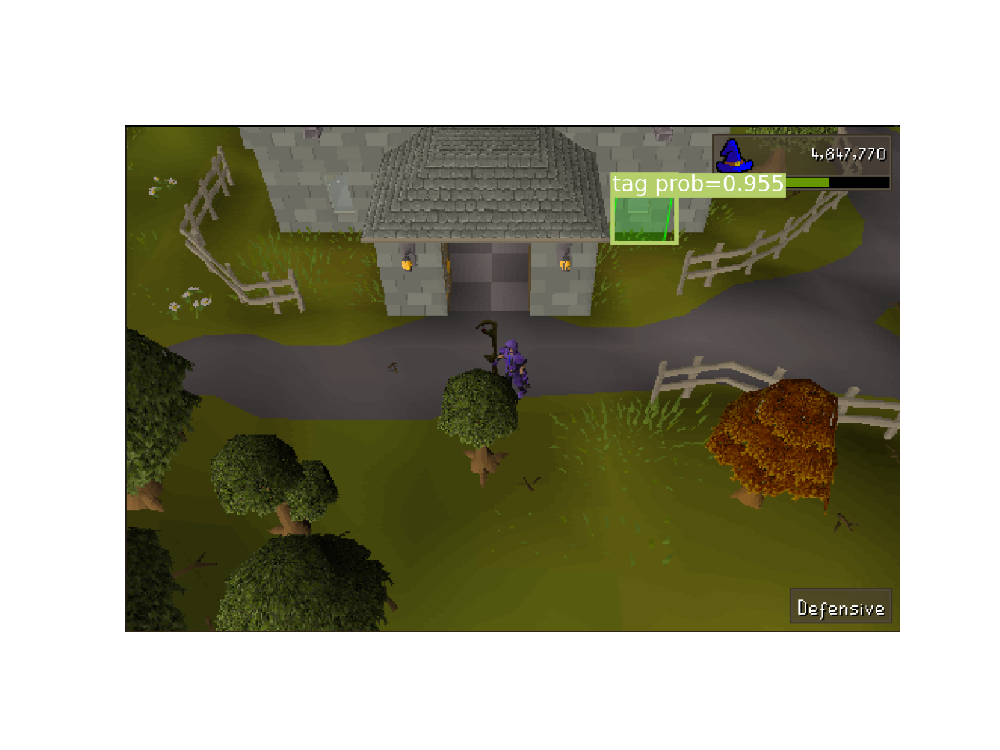
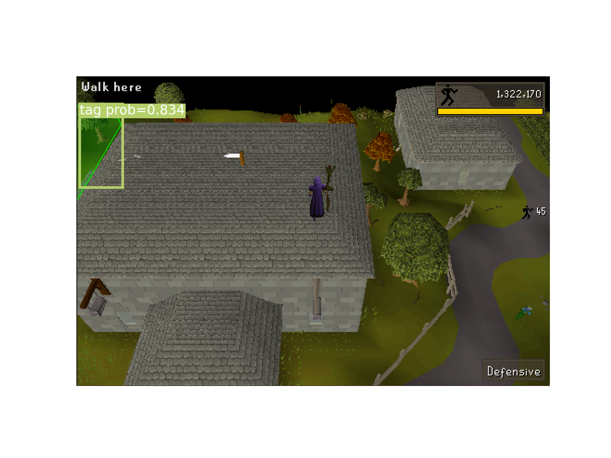

# OSVision

Image detection of OSRS objects using CNN.

## Example

Using OSVision and other modules from IAScape to run the Seers Village agility course.

Python program running on top of RuneLite.

Model detection visualization:

